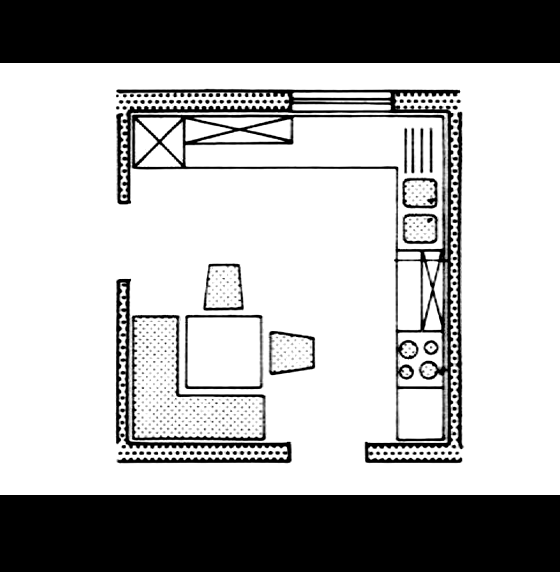
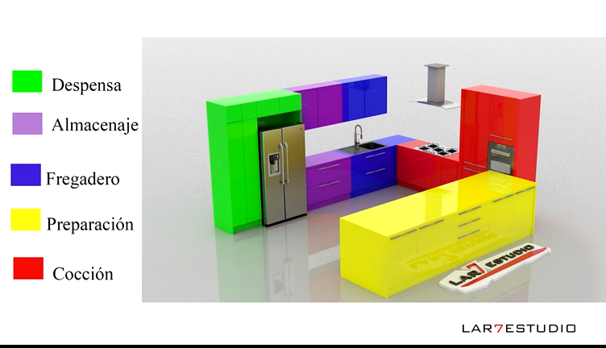

1. **Sobre CSS y Tailwind** => en proyectos grandes, podrías necesitar variantes (e.g., un <h1> en un hero section vs. un <h1> en un footer). Usar clases reutilizables como .heading-primary o .heading-hero (sin ser redundantes como .h1) puede dar más flexibilidad sin sacrificar semántica.

2. Necesito explicación de esto:

```
export function cn(...classes: Array<string | undefined | false | null>) {
  return classes.filter(Boolean).join(' ');
}
```

3. **Sobre la decisión de abtraer elementos `<Link>` y `<button>` en un solo `<Button>`** => Lo correcto no es “poner clases iguales en `<Link>` y `<button>` sino abstraer la lógica visual en un componente UI común, y dejar que cada elemento semántico cumpla su función.

4. **`Record<Size, string>`** => ipo utilitario de TypeScript que construye un objeto donde:
- K son las keys permitidas.
- T es el tipo de valor que tendrán esas keys (`string` porque las clases de Tailwind se representan como cadenas).

5. Si colocas el listener en document dentro de un componente ya estás escuchando globalmente, aunque el ref esté en el menú.

- La ventaja de usar document.addEventListener("mousedown", …) dentro del componente es que solo el handler conoce el ref del menú.
- Esto evita que tengas que tocar otros componentes como Navbar o body.
- Cada menú puede manejar su propio cierre, aislando la lógica.

```
useEffect(() => {
  const handleClickOutside = (event: MouseEvent) => {
    if (isOpen && menuRef.current && !menuRef.current.contains(event.target as Node)) {
      setIsOpen(false);
    }
  };
  document.addEventListener("mousedown", handleClickOutside);
  return () => document.removeEventListener("mousedown", handleClickOutside);
}, [isOpen, setIsOpen]);
```

## Exploring Cameras in Three.js
https://medium.com/@gopisaikrishna.vuta/exploring-cameras-in-three-js-32e268a6bebd

**Perspective camera** => perspective projection of real-world cameras,

```js
const camera = new THREE.PerspectiveCamera(
  fov, //field of view
  aspect, //aspect ratio
  near, // near clippling plane
  far // far clipping plane
)

camera.position.set(x,y,z)
```

**Orthograpic Camera** => Objects appear the same size regardless of their distance from the camera.

```js
const camera = new THREE.OrthographicCamera(
letf,
right,
top,
bottom,
near,
far
)

camera.position.set(x,y,z);
```

**CubeCamera** => capturing a panoramic view of the scene from a specific position. It renders the scene six times, each time capturing the view along one of the cube’s faces. This camera type is commonly used for creating reflections or environment maps.

```js
const cubeCamera = new THREE.CubeCamera(near, far, resolution);
cubeCamera.position.set(x,y,z);

scene.add(cubeCamera);
cubeCamera.update(renderer, scene);

```

**ArrayCamera** => array of cameras and switch between them

```js
const cameras = [
  new THREE.PerspectiveCamera(fov, aspect, near, far),
  new THREE.PerspectiveCamera(fov, aspect, near, far)
]
const camera = new THREE.ArrayCamera(cameras)
```

**StereoCamera** => to create stereoscopic 3D effects, providing a sense of depth perception by rendering separate views for the left and right eye. This camera type is commonly used for virtual reality (VR) or augmented reality (AR).

```js
const camera = THREE.StereoCamera()

// Set up left and right cameras
const leftCamera = camera.cameraL;
const rightCamera = camera.cameraR;

// Position the cameras
leftCamera.position.set(x,y,z);
rightCamera.position.set(x,y,z);

// Set the focal length for both cameras
leftCamera.focalLength = 10;
rightCamera.focalLength = 10;

```
```js
//To render the stereo view, you need to update the camera and render the scene twice, once for the left eye and once for the right eye. 

camera.update(renderer, scene);

renderer.setRenderTarget(renderer.getRenderTarget().left);
renderer.render(scene, leftCamera);

renderer.setRenderTarget(renderer.getRenderTarget().right);
renderer.render(scen, rightCamera);

renderer.setRenderTarget(null);
```

## SEO programático en Next.js: guía completa


we need to tell google to index our content different combinations, which cab be made by generating a sitemap then submitting to the google search console

what keywords I want to target in search

progammatic SEO works best with longtail keywords (specific search queries that are only interesting for a few people but you can serve a different versions of them to multiply their effect)


to create a url structure with slashes]: location and searching query. by doing this we can receive values in our page and then create different combinations of location and query, which is what we want for programmatic SEO


Perfecto — el error de TypeScript que ves:

```
Type 'string' is not assignable to type 'LinkVariant | undefined'.ts(2322)
```

indica que el prop `variant` que estás pasando a tu componente `<LinkItem>` **espera un tipo más específico que `string`**, concretamente un tipo literal o una unión tipada, probablemente algo así como:

```ts
type LinkVariant = 'primary' | 'secondary' | 'tertiary';
```

Sin embargo, en tu código estás pasando una variable `variant` que es de tipo `string` común (por ejemplo, `"primary"`), lo cual **no satisface la restricción del tipo** esperado (`LinkVariant | undefined`).

---

## Error de Tipado de prop externo insertado en iteración de mapa

El error proviene de esta línea:

```tsx
<LinkItem as="a" href={item.href} variant={variant}>
```

Donde el tipo del prop `variant` en `LinkItem` (según la definición de `LinkItemProps`) es:

```ts
variant?: LinkVariant;
```

y `LinkVariant` es probablemente algo como:

```ts
export type LinkVariant = "default" | "primary" | "secondary";
```

Si tu variable `variant` fue declarada simplemente como:

```ts
const variant = "primary";
```

TypeScript lo infiere como `string`, **no como el literal `'primary'`**. Por eso lanza el error.

---

### ✅ Soluciones posibles

#### **1. Tipar explícitamente la variable `variant`**

Declara el tipo literal al crear la variable:

```ts
const variant: LinkVariant = "primary";
```

De esa forma, TypeScript sabrá que `variant` pertenece al conjunto válido.

---

#### **2. Asegurarte de castear el valor si viene dinámico**

Si `variant` viene de props, datos externos o un map, puedes usar un type assertion:

```tsx
<LinkItem
  as="a"
  href={item.href}
  variant={variant as LinkVariant}
>
```

⚠️ Usa esto solo si estás seguro de que `variant` siempre será un valor válido dentro del enum o unión `LinkVariant`, pues TypeScript ya no podrá advertirte si le pasas un valor erróneo.

---

#### **3. Usar un fallback**

Si `variant` puede no venir definido, puedes asignar un valor por defecto:

```tsx
<LinkItem
  as="a"
  href={item.href}
  variant={variant ?? "default"}
>
```

Asegúrate de que `"default"` esté dentro de los valores aceptados por `LinkVariant`.

---

### 🧠 Recomendación profesional

Para mantener un tipado estricto y seguro:

* Define el tipo de `variant` en tus datos o props usando el tipo real:

  ```ts
  interface Item {
    key: string;
    href: string;
    variant?: LinkVariant;
  }
  ```

* Y al mapearlos:

  ```tsx
  {items.map((item) => (
    <li key={item.key}>
      <LinkItem as="a" href={item.href} variant={item.variant}>
        {t(item.key)}
      </LinkItem>
    </li>
  ))}
  ```

Esto evita inferencias erróneas del tipo `string`.

---

Si me muestras la definición del tipo `LinkItemProps` (o del componente `LinkItem`), puedo darte la solución exacta ajustada a tu caso, incluso si el `variant` viene de una prop superior o un hook de configuración. ¿Podrías pegar esa definición?


**`"use client"`** =>  obligatorio en Nextjs 13 en adelante para componentes que usan APIs del navegador (`window, eventos, WebGL`)

**`forwardRef`** => para que el padre pueda controlar métodos internos sin causar renders.`useImperativeHandle`, si alguna vez lo necesitas, solo funciona dentro de `forwardRef`.existe principalmente por razones de legado para componentes de clase. No hay una razón práctica para usarlo.New function components will no longer need forwardRef, and we will be publishing a codemod to automatically update your components to use the new ref prop. In future versions we will deprecate and remove forwardRef.técnica que nos permite acceder a una referencia de un componente hijo desde un componente padre. Una HOC factory que permite pasar una ref desde el padre hacia un componente funcional hijo.las funciones no aceptan la prop ref nativamente.
React reserva ref como una “prop especial” que no se transmite a los children como el resto de props.

forwardRef restablece manualmente ese canal.

```js  
const MyInput = React.forwardRef((props, ref) => {
  return <input ref={ref} {...props} />;
});
w
```
- Starting in React 19, you can now access ref as a prop for function components: 

```js
function MyInput({placeholder, ref}) {
  return <input placeholder={placeholder} ref={ref} />
}

//...
<MyInput ref={ref} />
```
- `useImperativeHandle` => Es muy común que un senior explique que:forwardRef posibilita la inyección de una ref y useImperativeHandle permite exponer una API imperativa personalizada hacia el padre:useImperativeHandle permite que tú generes un objeto imperativo que el padre puede invocar, pero no “retorna interacción”; simplemente expone métodos.

```js
useImperativeHandle(ref, () => ({
  focus: () => inputRef.current.focus(),
  reset: () => setValue("")
}));

```

- Una ref simplemente es un objeto estable con una propiedad .current.

- forwardRef no es un hook. Es un higher-order function que envuelve un componente de función para habilitar el reenvío de refs.forwardRef no sigue reglas de hooks ni depende del render cycle igual que un hook. 
- Un ref es una referencia mutable a un nodo DOM o a un objeto imperativo,
- El propósito real de forwardRef + useImperativeHandle no es enviar información, sino poder exponer una API imperativa del hijo hacia el padreEjemplos:

.focus()

.scrollToBottom()

.reset()

.validate()

.open() / .close() de un modal creado por ti

Acceder a un canvas, animaciones o código Three.js

- React es declarativo, los refs son la excepción imperativa.
- forwardRef existe para interoperabilidad con APIs externas (DOM, librerías legacy, canvas, websockets, mapas, Three.js).

-forwardRef() sí es necesario cuando tienes componentes envueltos por memo() y quieres mantener el ref funcional.
-forwardRef no sirve en componentes de clase, solo en function components.


**react/fiber** => result in a cleaner, smaller code base that’s easier to read and understand as the project progresses. React renderer for the three.js library, which allows you to build 3D graphics and scenes using React's declarative component-based approach. It lets developers use JSX to describe 3D scenes and components, simplifying the use of three.js for interactive web applications by managing the underlying 3D rendering logic. 

```js
import { createRoot } from 'react-dom/client'
import React, { useRef, useState } from 'react'
import { Canvas, useFrame } from '@react-three/fiber'
import './styles.css'

function Box(props) {
  // This reference will give us direct access to the mesh
  const meshRef = useRef()
  // Set up state for the hovered and active state
  const [hovered, setHover] = useState(false)
  const [active, setActive] = useState(false)
  // Subscribe this component to the render-loop, rotate the mesh every frame
  useFrame((state, delta) => (meshRef.current.rotation.x += delta))
  // Return view, these are regular three.js elements expressed in JSX
  return (
    <mesh
      {...props}
      ref={meshRef}
      scale={active ? 1.5 : 1}
      onClick={(event) => setActive(!active)}
      onPointerOver={(event) => setHover(true)}
      onPointerOut={(event) => setHover(false)}>
      <boxGeometry args={[1, 1, 1]} />
      <meshStandardMaterial color={hovered ? 'hotpink' : 'orange'} />
    </mesh>
  )
}

createRoot(document.getElementById('root')).render(
  <Canvas>
    <ambientLight intensity={Math.PI / 2} />
    <spotLight position={[10, 10, 10]} angle={0.15} penumbra={1} decay={0} intensity={Math.PI} />
    <pointLight position={[-10, -10, -10]} decay={0} intensity={Math.PI} />
    <Box position={[-1.2, 0, 0]} />
    <Box position={[1.2, 0, 0]} />
  </Canvas>,
)

```

**`useRef`** => referencia directa. Acceder al DOM de manera directa. Crear una variable mutable persistente entre renders Este punto es el caso de uso más realista para usar useRef. useRef para mantener la referencia del componente y solo realizar actualizaciones de estado cuando este se encuentre montado en la aplicación. useRef crea un contenedor mutable general-purpose que puede almacenar cualquier valor, con persistencia durante todo el ciclo de vida del componente. El ref vive solo dentro del componente en el que se declara. Lo que persiste es:

el objeto { current: ... }

a través de renders del mismo componente

Pero no atraviesa jerarquías de componentes diferentes.

useRef devuelve un objeto con una propiedad .current. React garantiza que ese objeto mantiene la misma identidad entre renders. Asignar un nuevo valor a .current no produce un re-render, porque React no lo usa para determinar el árbol de reconciliación. useRef es preferible a useState para valores mutables no render-dependientes

useRef es clave para evitar:

callbacks que capturan valores antiguos (closures caducas)

listeners que no se actualizan

animaciones que requieren valores vivos y siempre actualizados

“useRef se usa para crear refs.”

“forwardRef se usa para pasarlas hacia abajo.”

“useImperativeHandle se usa para definir la API imperativa.”



 

## 21 de NOV

Explicación de <Record<string, string>>
El tipo de utilidad Record<K, T> en TypeScript se utiliza para crear un tipo de objeto donde las claves son de tipo K y los valores son de tipo


## 22 DE NOV

**Archivos de Testing** => Históricamente, se solía separar el código (src/) de los tests (tests/) replicando la estructura de carpetas. Sin embargo, en el ecosistema moderno de React/Next.js, esa práctica ha quedado obsoleta en favor de la Co-ubicación (Colocation).


El error ocurre porque React espera que la propiedad key sea un primitivo (string o number). Sin embargo, TypeScript ha inferido (probablemente por una definición previa o una mezcla de tipos) que field.name o field.id podría ser del tipo String (con mayúscula, el Objeto Wrapper de JavaScript) en lugar de string (el tipo primitivo).

Para TypeScript y React: string !== String.

La Solución Robusta
La forma más segura y "senior" de resolver esto es forzar la coerción a primitivo explícitamente en el renderizado. Esto garantiza que, venga lo que venga (null, undefined, number o String object), React reciba un string válido.

Modifica tu bloque de código así:

```ts     
{/* 3. RENDERIZADO DE CAMPOS MANUALES */}
        {section.fields?.map((field, index) => (
            <FieldRenderer
                // SOLUCIÓN: Usamos String() para asegurar un primitivo.
                // Añadimos 'index' como fallback de último recurso para garantizar unicidad absoluta.
                key={String(field.id || field.name || index)} 
                
                field={field}
                sectionId={section.key} 
                onChange={onChange}
                
                // Para el value también es buena práctica asegurar el índice
                value={effectiveValues[field.name || field.id]}
            />
        ))}
```


¿Por qué sucede esto? (Análisis Técnico)
React.Key: La definición de tipo de React para key es type Key = string | number.

El Conflicto: Si en algún lugar de tu código (o en una librería externa) field.name se definió como String (interfaz de objeto) o si TypeScript infiere una unión compleja, el operador || resulta en un tipo string | String.

Incompatibilidad: El tipo String (objeto) no es asignable a string (primitivo), por lo tanto, no cumple con React.Key.

Verificación de tu Interfaz (Preventivo)
Para evitar que esto ocurra en otros lugares, asegúrate de que en tu archivo de tipos (types.ts o donde definas WizardFieldConfig), uses estrictamente minúsculas:

TypeScript

```ts
export interface WizardFieldConfig {
  id: string; // Correcto (minúscula)
  name?: string; // Correcto (minúscula)
  // NUNCA usar:
  // id: String; 
}
```

## 23 NOV

🎓 Masterclass: Domando el Store Genérico en TypeScript Estricto
1. El Diagnóstico: ¿Por qué falló todo al mismo tiempo?
El patrón que causó el 90% de tus errores fue el conflicto entre Flexibilidad (Store) vs. Rigidez (Componentes).

Tu Store (values): Es como una caja gigante de mudanza sin etiquetas. Puede contener libros, ropa, jarrones o basura (string | number | File | null | undefined).

Tus Componentes (useState): Son estanterías hechas a medida. Solo aceptan libros (Point[]), o solo aceptan ropa (MaterialSelections).

El Error Recurrente: TypeScript te gritaba: "¡No puedes intentar meter 'toda la caja de mudanza' en la estantería de libros! ¿Y si hay un jarrón dentro?"

2. Las 3 Estrategias de Defensa (Sin usar any)
Para solucionar esto, aplicamos tres técnicas de Ingeniería de Tipos.

Técnica A: La "Doble Aserción" (Double Assertion)
Usada en: RoomGeometryPlanner, Position, Compatibility

Cuando tú sabes más que TypeScript (ej. sabes que room_points siempre será un array de puntos), pero TypeScript ve un tipo incompatible, debes usar un intermediario.

El Problema: TS no te deja convertir un WizardStoreValue (unión compleja) directamente a Point[].

El Secreto: unknown. Es el tipo "padre" seguro.

La Fórmula:

TypeScript

// ❌ Error: No hay superposición
const points = values.room_points as Point[];

// ✅ Correcto: Pasamos por "desconocido" para limpiar el tipo anterior
const points = (values.room_points as unknown as Point[]);
Lección: unknown es la forma segura de decirle a TS "Olvida lo que sabes, confía en mi nuevo tipo". A diferencia de any, unknown te obliga a definir el tipo final.

Técnica B: El "Sanitizador de Datos" (Type Guarding)
Usada en: PreferenceWizardSection

Cuando los datos van a un lugar peligroso (como un <input> HTML que explota si recibe un objeto o null), no basta con el casting; necesitas filtrar el dato en tiempo de ejecución.

El Problema: El input espera string | number. El store podría tener undefined o un File.

La Solución: Crear una función "portero".

TypeScript

const getSafeValue = (val: unknown): string | number => {
   if (typeof val === 'string' || typeof val === 'number') return val;
   return ''; // Si es basura, devolvemos cadena vacía segura
};

// Uso:
value={getSafeValue(effectiveValues[field.id])}
Lección: Nunca confíes en los datos crudos del store cuando renderices inputs directos. Sanitiza siempre.

Técnica C: El "Type Predicate" (Guardia de Tipos)
Usada en: Preferences.tsx (con sectionHasAppliances)

Esta es la forma más elegante. Es una función que retorna un booleano, pero le dice al compilador que el dato cambió de tipo.

La Fórmula:

TypeScript

// Le dice a TS: "Si esto retorna true, 'section' es SectionWithAppliances"
const hasAppliances = (s: any): s is SectionWithAppliances => {
   return 'appliances' in s;
}
Lección: Úsalo cuando tengas lógica condicional (if) compleja para que TypeScript entienda qué pasa dentro del bloque.

3. Visualización del Flujo
Aquí es donde vivieron tus errores. Entender este diagrama es entender la arquitectura de tu app.

Store (Fuente): Tipo Ancho (Wide Type).

El Cuello de Botella: Aquí ocurrieron los errores. TS bloquea el paso.

La Solución: Aplicamos "Adaptadores" (Casting/Sanitizers).

Componente (Destino): Tipo Estrecho (Narrow Type).

4. Tu Checklist para el Futuro
La próxima vez que crees un componente conectado a Zustand en este proyecto, sigue estos 3 pasos para que Vercel no te rechace el build:

Lectura (Hydration):

¿Estoy leyendo un objeto complejo o array? -> Usa (values.key as unknown as MiInterfaz).

¿Estoy leyendo un primitivo para un input? -> Usa getSafeValue(values.key).

Escritura (Sync):

Al hacer setValue, si tu objeto local tiene una interfaz propia, conviértelo al salir: setValue('key', miObjetoLocal as unknown as WizardStoreValue).

Definición:

Nunca uses any. Si te bloqueas, usa unknown y luego haz el casting al tipo que debería ser.

- Agregar altura manual de ventanas y puertas como paramétro en modulo

- En Wizard, agregar imágens de referencia en lugar de texto para configuración de cocina: el U en L, etc