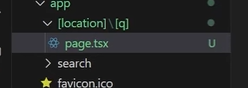

1. **Sobre CSS y Tailwind** => en proyectos grandes, podrías necesitar variantes (e.g., un <h1> en un hero section vs. un <h1> en un footer). Usar clases reutilizables como .heading-primary o .heading-hero (sin ser redundantes como .h1) puede dar más flexibilidad sin sacrificar semántica.

2. Necesito explicación de esto:

```
export function cn(...classes: Array<string | undefined | false | null>) {
  return classes.filter(Boolean).join(' ');
}
```

3. **Sobre la decisión de abtraer elementos `<Link>` y `<button>` en un solo `<Button>`** => Lo correcto no es “poner clases iguales en `<Link>` y `<button>` sino abstraer la lógica visual en un componente UI común, y dejar que cada elemento semántico cumpla su función.

4. **`Record<Size, string>`** => ipo utilitario de TypeScript que construye un objeto donde:
- K son las keys permitidas.
- T es el tipo de valor que tendrán esas keys (`string` porque las clases de Tailwind se representan como cadenas).

5. Si colocas el listener en document dentro de un componente ya estás escuchando globalmente, aunque el ref esté en el menú.

- La ventaja de usar document.addEventListener("mousedown", …) dentro del componente es que solo el handler conoce el ref del menú.
- Esto evita que tengas que tocar otros componentes como Navbar o body.
- Cada menú puede manejar su propio cierre, aislando la lógica.

```
useEffect(() => {
  const handleClickOutside = (event: MouseEvent) => {
    if (isOpen && menuRef.current && !menuRef.current.contains(event.target as Node)) {
      setIsOpen(false);
    }
  };
  document.addEventListener("mousedown", handleClickOutside);
  return () => document.removeEventListener("mousedown", handleClickOutside);
}, [isOpen, setIsOpen]);
```

## Exploring Cameras in Three.js
https://medium.com/@gopisaikrishna.vuta/exploring-cameras-in-three-js-32e268a6bebd

**Perspective camera** => perspective projection of real-world cameras,

```js
const camera = new THREE.PerspectiveCamera(
  fov, //field of view
  aspect, //aspect ratio
  near, // near clippling plane
  far // far clipping plane
)

camera.position.set(x,y,z)
```

**Orthograpic Camera** => Objects appear the same size regardless of their distance from the camera.

```js
const camera = new THREE.OrthographicCamera(
letf,
right,
top,
bottom,
near,
far
)

camera.position.set(x,y,z);
```

**CubeCamera** => capturing a panoramic view of the scene from a specific position. It renders the scene six times, each time capturing the view along one of the cube’s faces. This camera type is commonly used for creating reflections or environment maps.

```js
const cubeCamera = new THREE.CubeCamera(near, far, resolution);
cubeCamera.position.set(x,y,z);

scene.add(cubeCamera);
cubeCamera.update(renderer, scene);

```

**ArrayCamera** => array of cameras and switch between them

```js
const cameras = [
  new THREE.PerspectiveCamera(fov, aspect, near, far),
  new THREE.PerspectiveCamera(fov, aspect, near, far)
]
const camera = new THREE.ArrayCamera(cameras)
```

**StereoCamera** => to create stereoscopic 3D effects, providing a sense of depth perception by rendering separate views for the left and right eye. This camera type is commonly used for virtual reality (VR) or augmented reality (AR).

```js
const camera = THREE.StereoCamera()

// Set up left and right cameras
const leftCamera = camera.cameraL;
const rightCamera = camera.cameraR;

// Position the cameras
leftCamera.position.set(x,y,z);
rightCamera.position.set(x,y,z);

// Set the focal length for both cameras
leftCamera.focalLength = 10;
rightCamera.focalLength = 10;

```
```js
//To render the stereo view, you need to update the camera and render the scene twice, once for the left eye and once for the right eye. 

camera.update(renderer, scene);

renderer.setRenderTarget(renderer.getRenderTarget().left);
renderer.render(scene, leftCamera);

renderer.setRenderTarget(renderer.getRenderTarget().right);
renderer.render(scen, rightCamera);

renderer.setRenderTarget(null);
```

## SEO programático en Next.js: guía completa


we need to tell google to index our content different combinations, which cab be made by generating a sitemap then submitting to the google search console

what keywords I want to target in search

progammatic SEO works best with longtail keywords (specific search queries that are only interesting for a few people but you can serve a different versions of them to multiply their effect)


to create a url structure with slashes]: location and searching query. by doing this we can receive values in our page and then create different combinations of location and query, which is what we want for programmatic SEO


Perfecto — el error de TypeScript que ves:

```
Type 'string' is not assignable to type 'LinkVariant | undefined'.ts(2322)
```

indica que el prop `variant` que estás pasando a tu componente `<LinkItem>` **espera un tipo más específico que `string`**, concretamente un tipo literal o una unión tipada, probablemente algo así como:

```ts
type LinkVariant = 'primary' | 'secondary' | 'tertiary';
```

Sin embargo, en tu código estás pasando una variable `variant` que es de tipo `string` común (por ejemplo, `"primary"`), lo cual **no satisface la restricción del tipo** esperado (`LinkVariant | undefined`).

---

## Error de Tipado de prop externo insertado en iteración de mapa

El error proviene de esta línea:

```tsx
<LinkItem as="a" href={item.href} variant={variant}>
```

Donde el tipo del prop `variant` en `LinkItem` (según la definición de `LinkItemProps`) es:

```ts
variant?: LinkVariant;
```

y `LinkVariant` es probablemente algo como:

```ts
export type LinkVariant = "default" | "primary" | "secondary";
```

Si tu variable `variant` fue declarada simplemente como:

```ts
const variant = "primary";
```

TypeScript lo infiere como `string`, **no como el literal `'primary'`**. Por eso lanza el error.

---

### ✅ Soluciones posibles

#### **1. Tipar explícitamente la variable `variant`**

Declara el tipo literal al crear la variable:

```ts
const variant: LinkVariant = "primary";
```

De esa forma, TypeScript sabrá que `variant` pertenece al conjunto válido.

---

#### **2. Asegurarte de castear el valor si viene dinámico**

Si `variant` viene de props, datos externos o un map, puedes usar un type assertion:

```tsx
<LinkItem
  as="a"
  href={item.href}
  variant={variant as LinkVariant}
>
```

⚠️ Usa esto solo si estás seguro de que `variant` siempre será un valor válido dentro del enum o unión `LinkVariant`, pues TypeScript ya no podrá advertirte si le pasas un valor erróneo.

---

#### **3. Usar un fallback**

Si `variant` puede no venir definido, puedes asignar un valor por defecto:

```tsx
<LinkItem
  as="a"
  href={item.href}
  variant={variant ?? "default"}
>
```

Asegúrate de que `"default"` esté dentro de los valores aceptados por `LinkVariant`.

---

### 🧠 Recomendación profesional

Para mantener un tipado estricto y seguro:

* Define el tipo de `variant` en tus datos o props usando el tipo real:

  ```ts
  interface Item {
    key: string;
    href: string;
    variant?: LinkVariant;
  }
  ```

* Y al mapearlos:

  ```tsx
  {items.map((item) => (
    <li key={item.key}>
      <LinkItem as="a" href={item.href} variant={item.variant}>
        {t(item.key)}
      </LinkItem>
    </li>
  ))}
  ```

Esto evita inferencias erróneas del tipo `string`.

---

Si me muestras la definición del tipo `LinkItemProps` (o del componente `LinkItem`), puedo darte la solución exacta ajustada a tu caso, incluso si el `variant` viene de una prop superior o un hook de configuración. ¿Podrías pegar esa definición?
